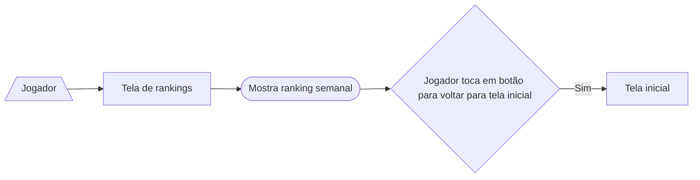
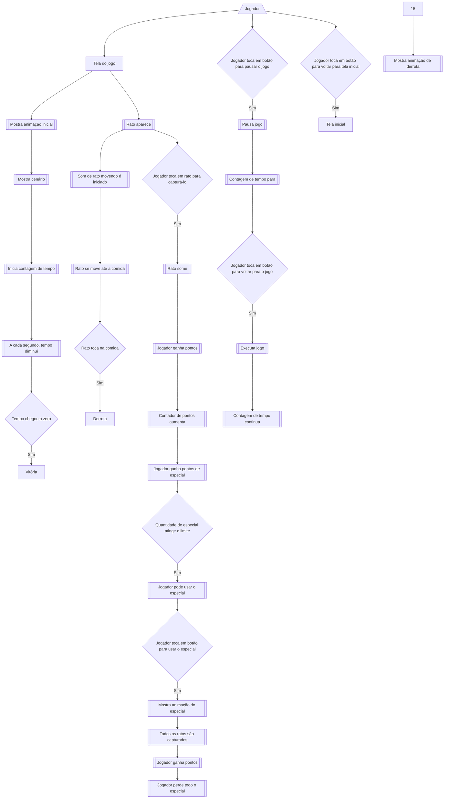

# Game Design Document

Nome do jogo: Catcher.

Um jogo no estilo plataforma 2D em que controlamos Catcher, um gato guarda da cozinha de um restaurante importante. Nesse mesmo restaurante, ratos moram escondidos e tentam roubar a comida. O objetivo do gato é não permitir que os ratos roubem a comida e deixar o dono do restaurante orgulhoso.

## Sinopse

Após um restaurante fechar as suas portas, Catcher (um gato) fica responsável por guardar a cozinha durante a noite escura. Enquanto isso, ratos tentam roubar a comida sem serem capturados pelo imparável guarda.

## Espaço e Tempo

O jogo se passa em um restaurante durante a noite, após o seu fechamento. O gato é o único que fica no restaurante durante a noite, pois é o guarda da cozinha.

Todas as luzes do restaurante estão apagadas. A cozinha é iluminada apenas por uma luz fraca que vem da rua, através da janela.

## Personagens

### Dono do restaurante

O dono do restaurante, que também é o chef, é um homem de 30 anos, magro, que veste um uniforme de cozinheiro. Ele é divertido, sorridente e orgulhoso do seu restaurante.

### Catcher

Catcher, o gato, é um gato determinado e preparado para qualquer situação. Ele é o guarda do restaurante e não vai deixar nenhum rato roubar a comida do restaurante. Sempre atento vestindo seu uniforme de guarda e sua longa cauda.

Possui diversas habilidades, como super-pulo, super-velocidade e um ataque especial onde sua cauda se transforma em um grande chicote para atacar todos os ratos de uma só vez.

### Ratos

Espertos, traiçoeiros e rápidos, os ratos querem roubar a comida do restaurante sem serem pegos pelo gato. Eles são vários e estão sempre tentando roubar a comida do restaurante.

Para isso, utilizarão de suas habilidades de correr, pular e escalar para roubar a comida do restaurante.

## Gameplay

### Características

Catcher é um jogo de plataforma 2D para dispositivos móveis. Tendo seu modo de jogar baseado em toques na tela, no qual o jogador deve tocar nos ratos para capturá-los.

Também possui botões de ação na parte inferior da tela para usar as habilidades do Catcher, como super-pulo, super-velocidade e um ataque especial onde sua cauda se transforma em um grande chicote para atacar todos os ratos de uma só vez.

Na parte superior da tela, há informações como o tempo restante para o restaurante abrir, a pontuação atual do jogador e a quantidade de especial disponível. Além de um botão para pausar o jogo.

### Mecânicas

Ratos aparecem aleatoriamente na tela, saindo de esconderijos. O jogador deve tocar nos ratos para capturá-los, ganhando pontos e um pouco de especial.

Aleatoriamente, múltiplos ratos podem aparecer de uma vez. Demandando velocidade e atenção do jogador.

Alguns ratos podem tentar se esconder atrás de objetos, como panelas, potes e caixas. Outros tentarão escalar as paredes ou pular por cima de objetos.

Quando o jogador acumula especial suficiente, pode usar o especial para capturar todos os ratos na tela. Mostrando uma animação do Catcher usando sua cauda como chicote para capturar todos os ratos.

Na progressão das fases, a velocidade e a quantidade de ratos aumenta. Trazendo cada vez mais desafios para o jogador.

### Resolução

Quando o tempo para o restaurante abrir acaba, o jogador tem sucesso ganhando pontos extras e passa de fase.

Nesse momento, uma animação mostra o dono do restaurante chegando para abrir o restaurante e orgulhoso do seu gato.

Caso um rato toque na comida, o jogador perde e uma animação mostra o dono do restaurante chegando para abrir o restaurante e triste por ter perdido a comida.

### Social

O jogo será integrado com o sistema de jogos do Google Play e Apple Game Center. Permitindo que o jogador compare sua pontuação com outros jogadores.

Também haverá rankings semanais, onde os jogadores que mais pontuarem aparecerão em uma tela específica para isso.

Dessa forma, os jogadores podem competir entre si para ver quem consegue a maior pontuação.

## Fluxograma

- Tela inicial
- Tela do jogo
- Tela de rankings

### Tela inicial

1. Jogador abre o jogo
2. Tela inicial aparece
3. Som de fundo começa a tocar
4. Jogador toca em botão para tirar som de fundo
   1. Som de fundo para de tocar
5. Jogador toca em botão para ver rankings
   1. Jogador é redirecionado para tela de rankings
6. Jogador toca em botão para iniciar o jogo
   1. Jogador é redirecionado para tela do jogo

### Tela de rankinga

1. Jogador é direcionado para tela de rankings
2. Tela de rankings aparece
3. Ranking semanal aparece
4. Jogador toca em botão para voltar para tela inicial
   1. Jogador é redirecionado para tela inicial

### Tela do jogo

1. Jogador é direcionado para tela do jogo
2. Animação inicial aparece
3. Cenário aparece
4. Inicia contagem de tempo
   1. A cada segundo, tempo diminui
   2. Tempo chega a zero
      1. Jogador vence
      2. Animação de vitória aparece
      3. Jogador avança de fase
         1. Retorna ao passo 3
5. Jogador toca em botão para pausar o jogo
   1. Jogo é pausado
   2. Contagem de tempo para
   3. Jogador toca em botão para voltar para o jogo
      1. Jogo é executado
      2. Contagem de tempo continua
6. Rato aparece
   1. Som de rato movendo é tocado
   2. Rato se move até a comida
      1. Rato toca na comida
         1. Jogador perde
         2. Animação de derrota aparece
         3. Jogador toca em botão para voltar para tela inicial
            1. Jogador é redirecionado para tela inicial
7. Jogador toca em rato para capturá-lo
   1. Rato some
   2. Jogador ganha pontos
      1. Contador de pontos aumenta
   3. Jogador ganha pontos de especial
      1. Quantidade de especial atinge o limite
         1. Jogador pode usar o especial
            1. Jogador toca em botão para usar o especial
               1. Animação do especial aparece
               2. Todos os ratos são capturados
               3. Jogador ganha pontos
               4. Jogador perde todo o especial

## Roteiro

- Dono do restaurante aparece
